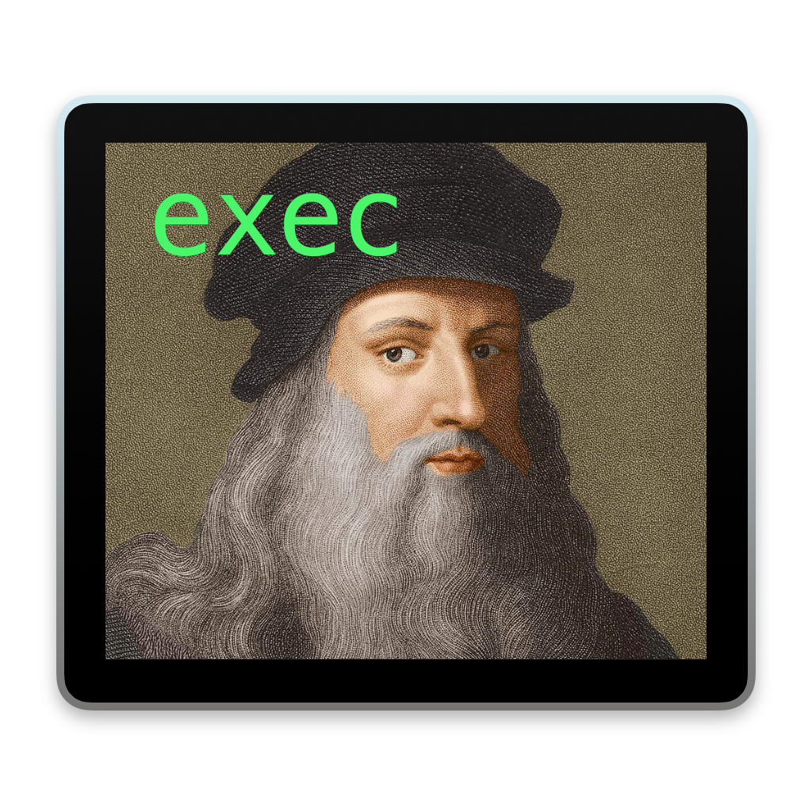

<div align = 'center'>
 </img>
<h1> da vinci </h1>
An all-purpose framework/library written with and for Python.
</div>

## Archive Notice:
`da vinci` will stop recieving major updates as of March 4, 2023. Minor changes and fixes _may_ be made, but no guarentees. New features will not be added and da vinci will not be tested further. Use at your own risk. The project may not function properly with newer versions of Python.

## Socials:

 

## Download:

  

## Developers:

 

 

 

 

## Features:
da vinci comes with 10 Python modules ready to use!
1. `data`
2. `debug`
3. `encrypt`
4. `files`
5. `game` (*experimental*)
6. `image`
7. `module` (*experimental*)
8. `turtl`
9. `fps`
10. `coords`

**Note:** Modules marked with 'experimental' may not function properly and may contain bugs.

**Note**: This framework/library has not been tested on Windows or Linux and may not work on them at all.

## Setup:
This will install Python modules (or dependencies) that are required to allow all features of EggEngine to work as intended.

1. Create a new Python file, you can name it anything you want.
2. Copy the folder `davinci` into the same diredctory.
3. In the Python file, add the following line:
```python
from davinci import module
```
- Or (not recommended) alternative:
```python
import davinci.module
```
4. Next, add this line:
```python
module.dependencies()
```
- If you used the alternative, add this line:
```python
davinci.module.dependencies()
```
5. Run/execute the Python file.
6. You're ready to use da vinci!
7. You can now delete this file.

## Integration:
Obviously, the first step would be to download the repository or from the latest release. Then, follow these steps:

1. Copy the folder `davinci` into your project folder.
2. In your Python file(s), add the following line: 
```python 
from davinci import <module you want to use>
```
-  For example, if I want to use the `data` module from `davinci`, I would add this line of code:
```python
from davinci import data
```
- If I wanted to use the `generateList()` function, this is what it would look like:
```python
data.generateList(...)
```
-  Another (not recommended) alternative:
```python
import davinci.<module you want to use>
```
- Following my example from earlier, this is what it would look like:
```python
import davinci.data
```
- The downside to this import statement is when calling functions, you must type out the parent module, then the module, and finally the function like this:
```python
davinci.data.generateList(...)
```
3. Now you're ready to start using da vinci in your project!

## License:
This project is licensed under the `GNU Lesser General Public License v2.1` license. 

License information can be found in `docs/LICENSE.md`.
